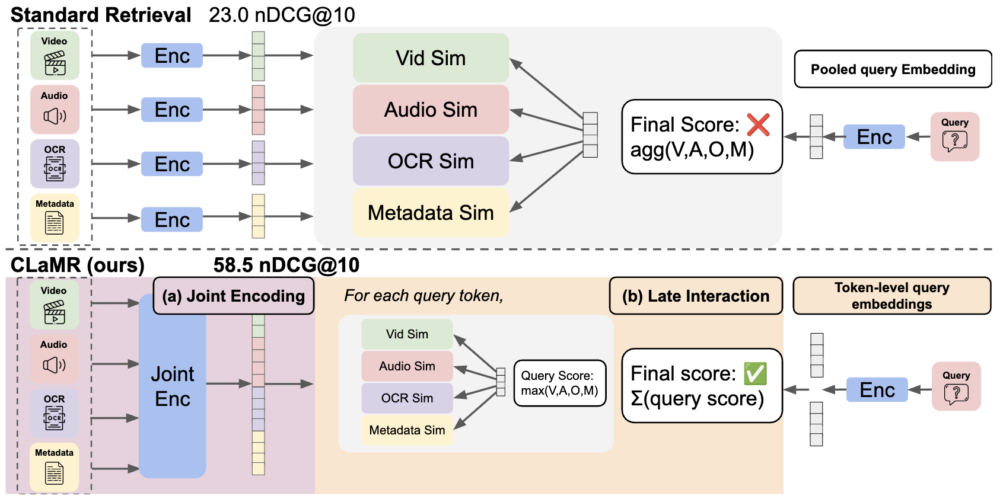

# CLaMR: Multimodal Late-Interaction Retrieval
by David Wan, Han Wang, Elias Stengel-Eskin, Jaemin Cho, Mohit Bansal



## Overview

This repository contains code and dataset for a multimodal content retrieval system based on contextualized late-interaction. The system is designed for retrieval tasks involving multiple modalities, such as video, text (ASR, OCR, descriptions), and images.

## Requirements

- `transformers`
- `datasets`
- `peft`
- `accelerate`
- `torchmetrics`
- `torch`

For Omni, you would need to install `pip install git+https://github.com/huggingface/transformers@v4.51.3-Qwen2.5-Omni-preview`


**Hardware:** We used 8 NVIDIA A100 80GB to train the models.

## Data

### MultiVent 2.0 ++
We provide the synthetically generated queries in `data/multivent_synthetic_{train,validation}_queries.json`. It maps each `video_id` to the following dictionary:
- `query`: The retrieval query.
- `query_type`: The modality of the query (e.g., "video", "ocr", "asr", "description").

Please combine this with the original Multivent 2.0 training data by mapping with the video_id.

### Datasets

We provide the code to transform the original data into the data that we expects for the models (`datasets.DatasetDict`). Please download the respective data: Multivent 2.0: https://huggingface.co/datasets/hltcoe/MultiVENT2.0

Additionally, we provide the processed datasets [here](https://drive.google.com/drive/folders/1aKP08Ab0yZwN9R_tLuDhyJ-WkqRYB-G0?usp=sharing).


Example entry:
```json
{
  "video_id": "train_000884_Wp2WiEz439s",
  "query": "Jinhae urban regeneration project",
  "query_type": "video",
  "ocr": "...",
  "description": "...",
  "asr": "...",
  "images": ["frame1.jpg", "frame2.jpg", ...]
}
```

You would also need to extract the frames as jpg, and audio as wav for Omni model.

## Code Structure

- `src/main.py`: Main entry point for training and evaluation. Supports argument parsing for model/data/training configuration.
- `src/models/`: Contains model architectures and processors. The primary model is `ColQwen2_5` (see `models/qwen2_5/`).
- `src/loss.py`: Implements various loss functions (contrastive, hard positive/negative, pairwise).
- `src/multimodal_collator.py`: Data collation for multimodal batches.
- `src/trainer.py`: Custom trainer for late-interaction retrieval.
- `src/util.py`: Utility functions, mappings, and metric computation.

## Training

Example command to train the model:
```bash
accelerate launch src/main.py --do_train --do_eval \
  --data_dir data/multivent_synthetic_hf --frames_dir data/frames/multivent \
  --dataloader_num_workers 4 \
  --model-type colqwen --model_name_or_path <HF_MODEL_NAME> --quantize_4bit \
  --do_peft --lora_r 128 --lora_alpha 128 --lora_dropout 0.1 \
  --lora_target_modules "(.*(model).*(down_proj|gate_proj|up_proj|k_proj|q_proj|v_proj|o_proj).*$|.*(custom_text_proj).*$)" \
  --num_train_epochs 1 --warmup_ratio 0.1 \
  --per_device_train_batch_size 4 --per_device_eval_batch_size 2 \
  --learning_rate 1e-5 --optim paged_adamw_8bit \
  --weight_decay 0.01 --logging_steps 1 \
  --save_strategy steps --save_steps 2500 --eval_strategy no \
  --output_dir multivent_vlm --overwrite_output_dir \
  --loss_type contrastive --combine_modalities --aggregation_method modality_max
```
Replace `<HF_MODEL_NAME>` with the desired HuggingFace model identifier.

### Running with video.
We primarily use the version where we explicitly mention the frames files (row `images` and supplying `frames_dir`). If you would like to use the original processor's preporcessing step of the videos, supply the `video_dir` and it should automatically use that instead.

### Running with OmniModel

Example to run:
```bash
accelerate launch src/main.py --do_train \
  --data_dir data/msrvtt_hf_videos \
  --video_dir videos/msrvtt/ --audio_dir audios/msrvtt \
  --dataloader_num_workers 2 \
  --model-type colqwenomni --model_name_or_path Qwen/Qwen2.5-Omni-3B --quantize_4bit \
  --do_peft --lora_r 128 --lora_alpha 128 --lora_dropout 0.1 \
  --lora_target_modules "(.*(model).*(down_proj|gate_proj|up_proj|k_proj|q_proj|v_proj|o_proj).*$|.*(custom_text_proj).*$)" \
  --num_train_epochs 5 --warmup_ratio 0.1 \
  --per_device_train_batch_size 1 --per_device_eval_batch_size 1 \
  --learning_rate ${lr} --optim paged_adamw_8bit \
  --weight_decay 0.01 --logging_steps 1 \
  --save_strategy epoch --eval_strategy no \
  --output_dir msrvtt_omni --overwrite_output_dir --combine_modalities --aggregation_method modality_max
        
```

## Evaluation

Example command to evaluate a trained model:
```bash
accelerate launch --main_process_port 10086 src/main.py --do_eval \
  --data_dir data/multivent_test_hf --frames_dir <FRAMES_DIR> \
  --dataloader_num_workers 8 \
  --model-type colqwen --model_name_or_path <HF_MODEL_NAME> --quantize_4bit \
  --do_peft --lora_r 128 --lora_alpha 128 --lora_dropout 0.1 \
  --lora_target_modules "(.*(model).*(down_proj|gate_proj|up_proj|k_proj|q_proj|v_proj|o_proj).*$|.*(custom_text_proj).*$)" \
  --num_train_epochs 5 --warmup_ratio 0.1 \
  --per_device_train_batch_size 2 --per_device_eval_batch_size 4 \
  --learning_rate 1e-5 --optim paged_adamw_8bit \
  --weight_decay 0.01 --logging_steps 1 \
  --save_strategy epoch --eval_strategy epoch \
  --output_dir <CHECKPOINT_DIR> \
  --pretrained_peft_model_name_or_path <CHECKPOINT_DIR> --combine_modalities
```
Replace `<FRAMES_DIR>` and `<CHECKPOINT_DIR>` as appropriate.

## Citation

If you find our project useful in your research, please cite the following paper:

```bibtex
@misc{wan2025clamrcontextualizedlateinteractionmultimodal,
      title={CLaMR: Contextualized Late-Interaction for Multimodal Content Retrieval}, 
      author={David Wan and Han Wang and Elias Stengel-Eskin and Jaemin Cho and Mohit Bansal},
      year={2025},
      eprint={2506.06144},
      archivePrefix={arXiv},
      primaryClass={cs.CV},
      url={https://arxiv.org/abs/2506.06144}, 
}
```